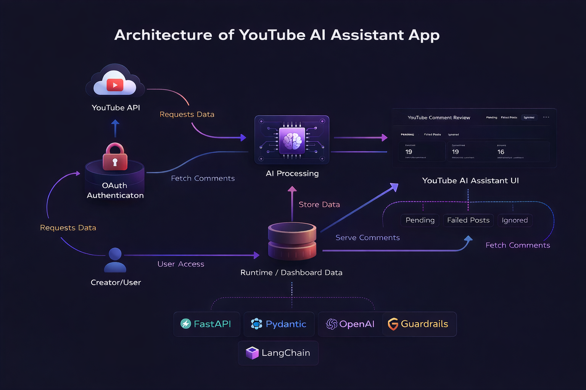
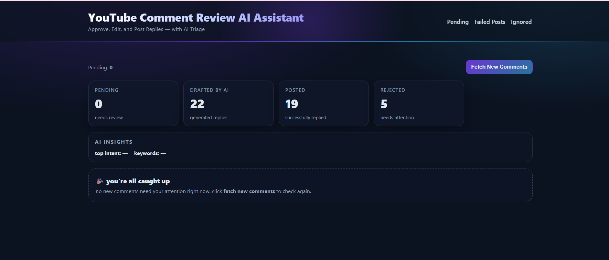
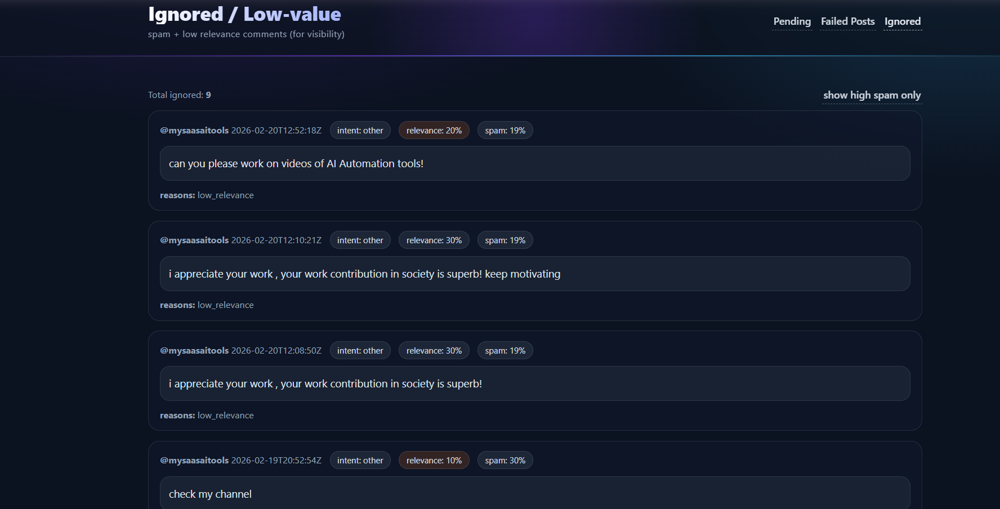
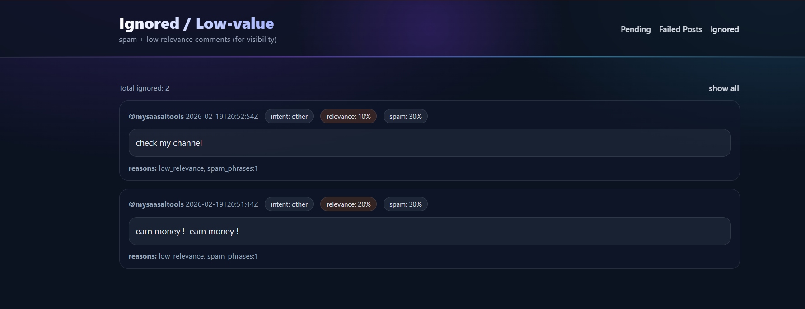
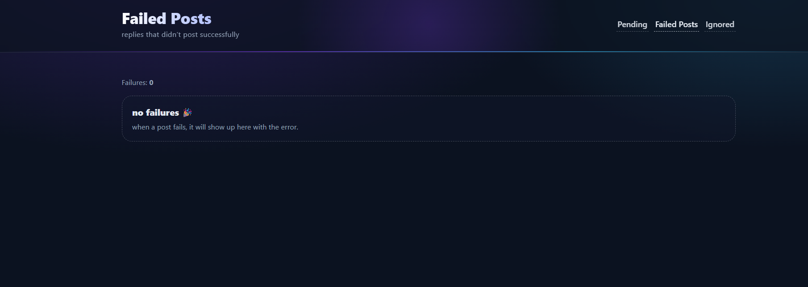

# YouTube AI Comment Assistant

Reply to YouTube comments faster while keeping full human control.

An AI-powered backend that fetches, classifies, drafts, and manages YouTube comment replies — with a human approval step before publishing.

Built with Python, FastAPI, YouTube OAuth, Guardrail, and OpenAI.

---

## Overview

Managing YouTube comments at scale is time-consuming and inconsistent. This assistant provides an automated, human-in-the-loop workflow that:

- Fetches new comments automatically
- Classifies them using AI
- Generates contextual reply drafts
- Stores drafts for traceability
- Presents drafts in a FastAPI review UI for human approval
- Publishes approved replies to YouTube

AI assists; humans decide.

## Problem

Growing channels receive dozens to hundreds of comments daily. Manual reply management:

- Consumes hours every week
- Creates inconsistent messaging
- Makes it easy to miss important questions
- Contributes to creator burnout

There is no simple, auditable workflow for handling comments intelligently at scale.

## Solution

This project implements a structured AI workflow:

1. Fetch new comments via YouTube OAuth
2. Classify each comment using AI (question, complaint, praise, other)
3. Generate contextual reply drafts
4. Store drafts locally for traceability
5. Review in a FastAPI-based UI
6. Approve → Publish to YouTube

## Key Features

- Automated comment fetching
- AI-based triage and classification
- AI-generated reply drafting
- Human-in-the-loop approval UI
- Runtime metrics tracking
- Local secret management (no secrets in repo)

## Architecture

YouTube API → Fetcher → AI Triage → AI Drafter → Runtime Store → Review UI → Publish



## Tech Stack

- Python 3.10+
- FastAPI
- Uvicorn
- Pydantic
- YouTube Data API (OAuth 2.0)
- OpenAI API
- JSON-based runtime state management

## Security & Safety

- No secrets stored in the repository
- API keys and tokens kept in the `secrets/` directory
- Human approval required before posting to YouTube
- Runtime data isolated under the `runtime/` folder

## Quickstart (Windows)

1) Clone repository

```bash
git clone https://github.com/engrwardakhan-collab/Youtube-AI-Assistant-App.git
cd youtube-ai-assistant
```

2) Create and activate a virtual environment

```powershell
python -m venv .venv
.\.venv\Scripts\Activate.ps1
```

3) Install dependencies

```bash
pip install -r requirements.txt
```

4) Configure environment

Copy `.env.example` to `.env` and fill in the required values:

- `YT_CLIENT_ID`
- `YT_CLIENT_SECRET`
- `YOUTUBE_CHANNEL_ID`
- `ACCESS_TOKEN_PATH` (optional; defaults to `runtime/access_token.json`)

Place secret files in `secrets/`:

- `secrets/openai_api_key`
- `secrets/refresh_token.txt`

5) Run the web review UI

```powershell
.\run-ui.bat
```

Open the UI at: http://127.0.0.1:8000

6) Run the CLI workflow (fetch + draft)

```powershell
.\run-cli.bat
```

## Project Structure

- `app/` — application code
  - `ai/` — AI triage and drafting logic
  - `youtube/` — YouTube integration
  - `review/` — review UI and metrics
  - `auth/` — OAuth and token management
- `runtime/` — runtime state (drafts, processed, errors)
- `secrets/` — local secret files (not checked into git)
- `main.py`, `requirements.txt`, `run-ui.bat`, `run-cli.bat`

## Screenshots






## Demo

Watch a quick demo: https://www.loom.com/share/3948c00a2bd947babbfcb6c998527710

## Notes

- This project preserves human review as a strict requirement before publishing to YouTube.
- Keep sensitive keys out of version control — use the `secrets/` folder or a secure secrets manager.

---

## Author

Warda Khan — Applied AI Engineer | AI Autamation Engineer

### Acknowledgements

Copilot and Copilot Chat were used during development for scaffolding and debugging.
